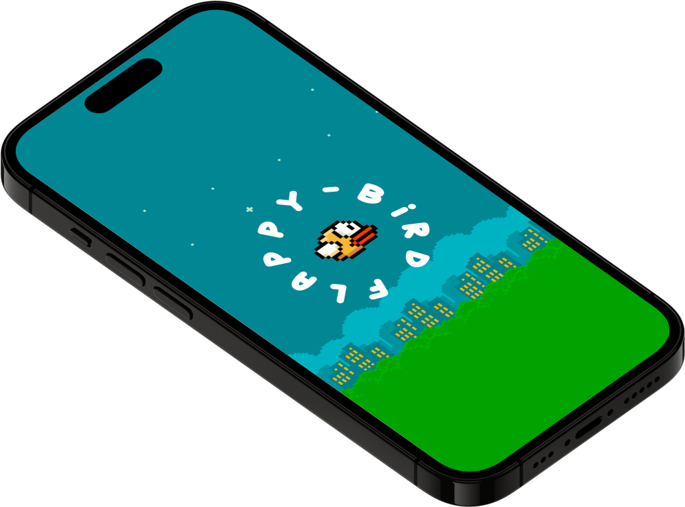

# Flappy-Bird


A ridiculous game created by [Flutter](https://flutter.dev/), all you have to do is touch the screen to make the bird leap as long as you avoid the barriers, you'll be OK. Depending on how long you play for, the score will be calculated. On the screen, your top score will always be displayed. 

[Hive](https://docs.hivedb.dev/#/) is a lightweight, user-friendly, and ❤️ Simple, powerful database with 🎈 NO native dependencies that we utilize.


## Features ⚡️
- You may choose the color of the bird.
- The background can be modified.
- You can choose the level of difficulty.
- The music can be muted.


## Issues
- The barriers are not 100% accurate
- According to the screen boundaries, there's no landscape mode.

## Colors
               

## Installation
you can just download the `.apk` file from the [Release](https://github.com/moha-b/Flappy-Bird/releases).

if you clone it just run
 ```dart
$ flutter pub get
```

## 🤓 Good people

<a href="https://github.com/moha-b"></a>
<a href="https://github.com/linah31"></a>
<a href="https://github.com/SalmaBasem20191743"></a>

<br>
<br>
<br>


## Techniques used 🛠️



- Minimum SDK level 21
- Architecture
    - MVC
- [Hive](https://pub.dev/packages/hive) - GetX is an extra-light and powerful solution for Flutter.
- [flutter_launcher_icons](https://pub.dev/packages/flutter_launcher_icons) - A command-line tool that simplifies the task of updating your Flutter app's launcher icon.
- [audio_players](https://pub.dev/packages/audioplayers) - A Flutter plugin to play multiple audio files simultaneously
- [webview_flutter](https://pub.dev/packages/webview_flutter) - A Flutter plugin that provides a WebView widget on Android and iOS
- [Http](https://pub.dev/packages/http) - A composable, multi-platform, Future-based API for HTTP requests.
- [url_launcher](https://pub.dev/packages/url_launcher) - Flutter plugin for launching a URL. Supports web, phone, SMS, and email schemes.
- [path_provider](https://pub.dev/packages/path_provider) - Flutter plugin for getting commonly used locations on host platform file systems, such as the temp and app data directories.
- [url_launcher](https://pub.dev/packages/lottie) - Render After Effects animations natively on Flutter. This package is a pure Dart implementation of a Lottie player
- [smooth_star_rating_null_safety](https://pub.dev/packages/smooth_star_rating_null_safety) - A smooth rating bar


----


This game is the culmination of the University-sponsored [Next Academy's](https://next-eg.com/) flutter programming instruction.
